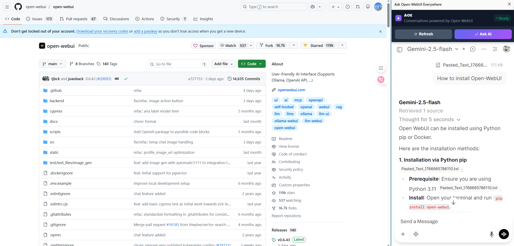

Sure! Here is a refined version of your project description, structured as a professional GitHub README. I have polished the content to sound more natural and engaging in English.

***

# AOE: Ask OpenWebUI Everywhere

**AOE** is a browser extension designed to integrate [OpenWebUI](https://github.com/open-webui/open-webui) directly into your browsing experience.

OpenWebUI is a powerful, beautifully designed AI tool that allows for extensive model customization. For many of us, it has become an indispensable part of our daily workflow. However, constantly switching tabs to copy and paste content from web pages into an AI chat can be tedious and disruptive. Furthermore, pasting raw text often lacks the necessary context for the AI to provide accurate answers.

**AOE** solves this by opening an OpenWebUI chat interface directly in your browser's side panel (requires a modern browser). This allows you to interact with AI alongside any web page you are viewing. The goal is simple: **Ask OpenWebUI, Everywhere.**

## Features

- **Side Panel Integration:** Access your OpenWebUI instance without leaving your current tab.
- **One-Click Context:** Click "Ask AI" to automatically parse the current web page's text and attach it to the chat as a file.
- **Context-Aware:** By uploading the page content as a file attachment, the AI receives the full context needed for accurate Q&A.

## Browser Requirements
Due to inconsistencies in Side Panel API support across older browser versions, it is highly recommended to upgrade to the latest version of your browser. 

AOE has been tested and verified on the following versions:

Microsoft Edge: 143.0.3650.96 (or higher)
Google Chrome: 143.0.7499.169 (or higher)

## Installation (Chrome Example)

1.  **Download the Source Code:**
    Clone or download the `AOE` folder from this repository to your local machine.

2.  **Load the Extension:**
    - Open Chrome and navigate to `chrome://extensions/`.
    - Toggle **Developer mode** in the top right corner.
    - Click **Load unpacked** and select the `AOE` folder you just downloaded.

## Configuration

1.  **Access Settings:**
    Right-click the AOE extension icon in your browser toolbar and select **Options**.

2.  **Configure URLs:**
    - **UI URL:** Enter the address of your OpenWebUI instance. You can include a specific model to ensure it loads by default every time.
      - *Example:* `http://myopenwebui.xxx.com/`
      - *Example with Model:* `http://myopenwebui.xxx.com/?model=gemini-3-pro`
    
    - **Target Match URL:** Enter the pattern for permissions (usually your domain with a **wildcard**).
      - *Example:* `http://myopenwebui.xxx.com/*`

3.  **OpenWebUI Settings:**
    - In your OpenWebUI instance, go to **Settings > Interface**.
    - Enable the option **"Paste Large Text as File"**.
    - Click **Save**.

## Usage

1.  Navigate to any web page you want to analyze.
2.  Click the AOE icon to open the browser side panel.
3.  Once the panel loads, click the **"Ask AI"** button.
4.  The extension will extract the page text and attach it to the chat input as a file.
5.  Type your question and start chatting!

## How it Works

OpenWebUI has a feature where pasted text exceeding 1,000 characters is automatically converted into a file upload. This extension leverages that mechanism cleverly:

1.  When you click "Ask AI", the extension's page parser extracts the relevant text from the current webpage.
2.  It simulates a paste action with a "dummy" string longer than 1,000 characters to trigger the OpenWebUI file upload function.
3.  The extension then intercepts this process and swaps the dummy text with the *actual* webpage text (even if the real text is shorter than 1,000 characters).
4.  This ensures the content is always uploaded cleanly as a file attachment, preserving context.

## Development & Contributing

### Future Improvements
- **Text Extraction:** Currently, the extension filters out specific tags (e.g., `SCRIPT`, `STYLE`, `NAV`, `AD`) to clean up the content. I previously experimented with `Readability.js`, but it resulted in some data loss. The current visibility-check method works but has room for improvement.
- **API Integration:** I attempted to use OpenWebUI's file upload API, but had difficulty getting the file to appear directly in the current chat context without complex chaining. If you have experience with this, contributions are welcome!

### Excluded Tags
The current parser ignores the following HTML tags to reduce noise:
`['SCRIPT', 'STYLE', 'NOSCRIPT', 'IFRAME', 'CANVAS', 'SVG', 'HEADER', 'FOOTER', 'NAV', 'TEXTAREA', 'SELECT', 'APPLET', 'MAP']`

I welcome all feedback, discussions, and pull requests to make AOE better!

## License

[MIT](LICENSE)